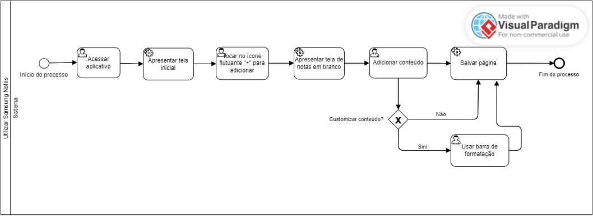
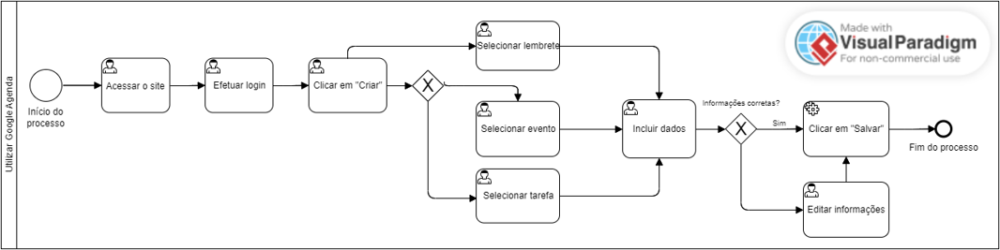
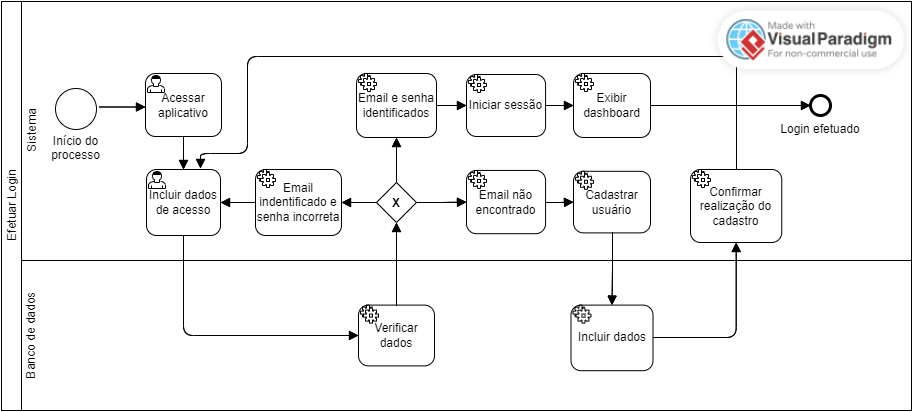
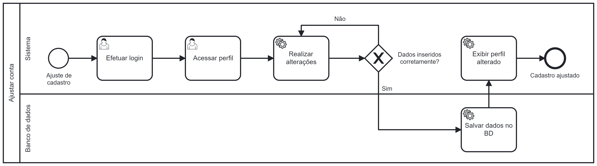
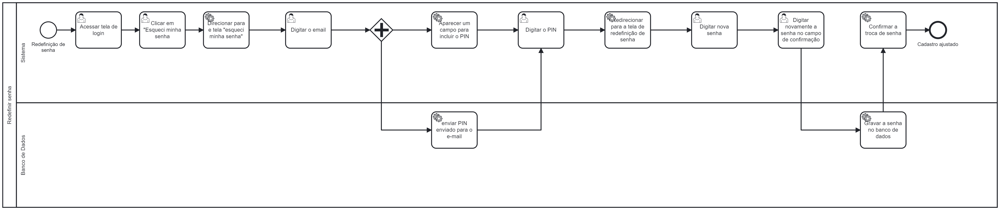
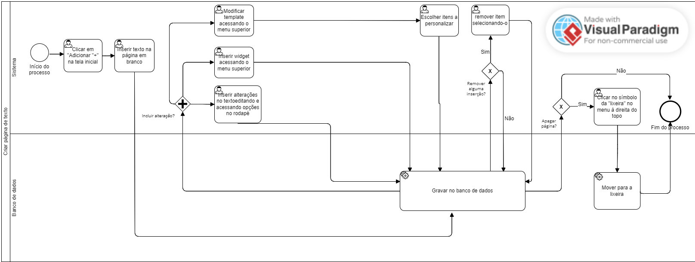
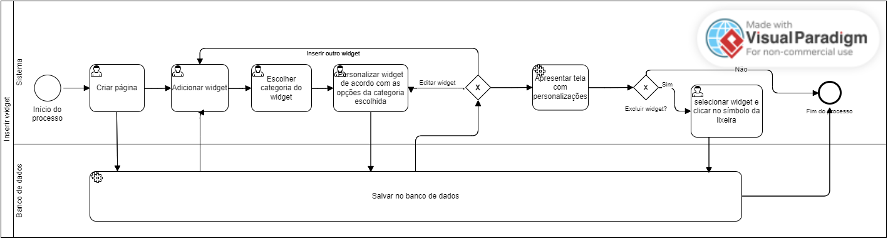
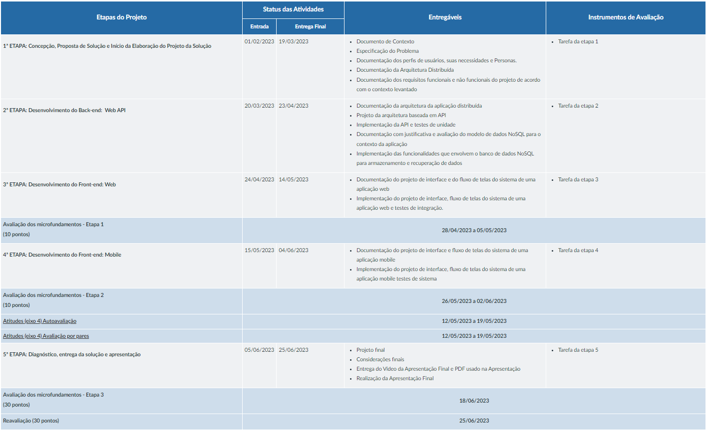
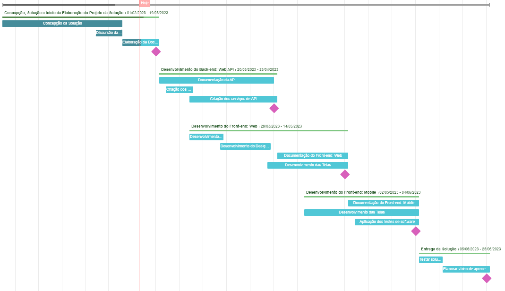
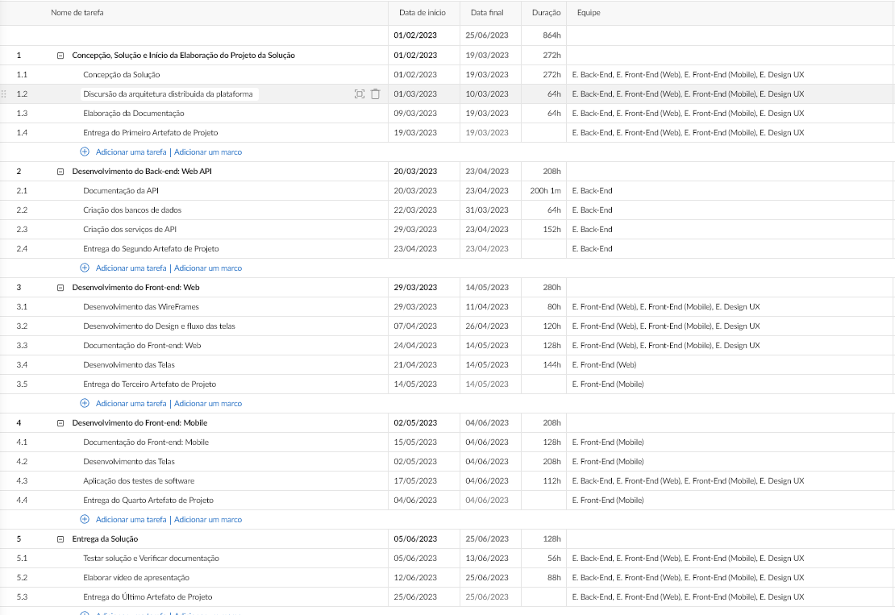

 # Especificações do Projeto

Pré-requisitos: <a href="1-Documentação de Contexto.md"> Documentação de Contexto</a>

Definição do problema e ideia de solução a partir da perspectiva do usuário. É composta pela definição do diagrama de personas, histórias de usuários, requisitos funcionais e não funcionais além das restrições do projeto.

Apresente uma visão geral do que será abordado nesta parte do documento, enumerando as técnicas e/ou ferramentas utilizadas para realizar a especificações do projeto

## Personas

Pedro Paulo tem 26 anos, é arquiteto recém-formado e autônomo. Pensa em se desenvolver profissionalmente através de um mestrado fora do país, pois adora viajar, é solteiro e sempre quis fazer um intercâmbio. Está buscando uma agência que o ajude a encontrar universidades na Europa que aceitem alunos estrangeiros.

Enumere e detalhe as personas da sua solução. Para tanto, baseie-se tanto nos documentos disponibilizados na disciplina e/ou nos seguintes links:

> **Links Úteis**:
>
> - [Rock Content](https://rockcontent.com/blog/personas/)
> - [Hotmart](https://blog.hotmart.com/pt-br/como-criar-persona-negocio/)
> - [O que é persona?](https://resultadosdigitais.com.br/blog/persona-o-que-e/)
> - [Persona x Público-alvo](https://flammo.com.br/blog/persona-e-publico-alvo-qual-a-diferenca/)
> - [Mapa de Empatia](https://resultadosdigitais.com.br/blog/mapa-da-empatia/)
> - [Mapa de Stalkeholders](https://www.racecomunicacao.com.br/blog/como-fazer-o-mapeamento-de-stakeholders/)
>
> Lembre-se que você deve ser enumerar e descrever precisamente e personalizada todos os clientes ideais que sua solução almeja.

## Histórias de Usuários

Com base na análise das personas forma identificadas as seguintes histórias de usuários:

| EU COMO... `PERSONA` | QUERO/PRECISO ... `FUNCIONALIDADE` | PARA ... `MOTIVO/VALOR`                |
| -------------------- | ---------------------------------- | -------------------------------------- |
| Usuário do sistema   | Registrar minhas tarefas           | Não esquecer de fazê-las               |
| Administrador        | Alterar permissões                 | Permitir que possam administrar contas |

Apresente aqui as histórias de usuário que são relevantes para o projeto de sua solução. As Histórias de Usuário consistem em uma ferramenta poderosa para a compreensão e elicitação dos requisitos funcionais e não funcionais da sua aplicação. Se possível, agrupe as histórias de usuário por contexto, para facilitar consultas recorrentes à essa parte do documento.

> **Links Úteis**:
>
> - [Histórias de usuários com exemplos e template](https://www.atlassian.com/br/agile/project-management/user-stories)
> - [Como escrever boas histórias de usuário (User Stories)](https://medium.com/vertice/como-escrever-boas-users-stories-hist%C3%B3rias-de-usu%C3%A1rios-b29c75043fac)
> - [User Stories: requisitos que humanos entendem](https://www.luiztools.com.br/post/user-stories-descricao-de-requisitos-que-humanos-entendem/)
> - [Histórias de Usuários: mais exemplos](https://www.reqview.com/doc/user-stories-example.html)
> - [9 Common User Story Mistakes](https://airfocus.com/blog/user-story-mistakes/)

## Modelagem do Processo de Negócio

### Análise da Situação Atual

Atualmente, é comum a organização da rotina e objetivos por meio de planners físicos disponíveis para a aquisição no mercado. As pessoas que preferem estruturar sua jornada em aplicativos, utilizam ferramentas diversas tais como: notes, calendários online e quadros kanban.

Na figura que se segue vê-se o funcionamento do Samsung Notes, aplicativo nativo de smartphones da marca Samsung. Ele permite, de forma customizada, criar pastas e páginas, categorizando diferentes registros no aplicativo. Nele, adiciona-se texto, desenhos à mão livre, arquivos em pdf, imagens e gravação de voz.

Demonstrado na próxima figura o diagrama do Google Agenda. Nessa ferramenta é possível incluir, monitorar e configurar alertas de eventos, compromissos, além de compartilhar a agenda com pessoas de interesse.

O quadro kanban é uma ferramenta de fluxo de trabalho e monitoramento de tarefas. Pode-se adicionar arquivos e checklists e gerenciá-lo em equipe. Um dos modos mais simples de ser utilizado é criando colunas “A fazer”, “Fazendo” e “Feito” e acrescentar e mover os cartões das atividades nas respectivas colunas que evidenciam o status de cada tarefa. Na Figura abaixo, demonstra-se a utilização da ferramenta Trello.

### Descrição Geral da Proposta

A modelagem dos processos de negócio neste projeto tem como principais alvos o alinhamento das estratégias, a demonstração do valor de cada processo e o comum entendimento acerca do funcionamento de uma atividade para o desenvolvimento da aplicação. Busca-se, assim, a criação de uma rotina de melhoria contínua do processo no contexto de toda a organização.

### Processo 1 – EFETUAR LOGIN

O processo denominado “Efetuar Login” começa com o acesso ao aplicativo. É apresentada a tela para inserção dos dados de acesso. Caso o usuário já seja cadastrado, ao inserir o e-mail e senha, sendo identificados pelo banco de dados, a sessão é iniciada com a visualização do dashboard.
Todavia, caso o usuário já cadastrado insira suas informações com e-mail correto, mas com senha inválida, o banco de dados não valida as inserções e o usuário permanece na tela para digitar os dados corretos. Após isso, o banco de dados reconhece a autenticação, a sessão inicia e apresenta a tela com o dashboard.
Em um terceiro cenário, em que o banco de dados não reconhece o e-mail, o usuário deverá realizar seu cadastro, preenchendo os dados solicitados em tela. As informações são incluídas no banco de dados, o sistema confirma a realização do cadastro e direciona para a tela de login, as informações de acesso são incluídas, a sessão é iniciada onde se visualiza a tela de dashboard.
Por ser um processo que identifica o usuário na aplicação, sua importância é percebida na segurança dos dados ao se conectar na plataforma.

### Processo 2 – AJUSTAR DADOS CADASTRAIS

O segundo processo, intitulado “Ajustar dados cadastrais” se inicia com a realização do login. O processo segue com o acesso ao perfil onde é possível editar dados cadastrais. Se os dados não estiverem preenchidos corretamente, a aplicação continua na tela de edição e exibe uma mensagem de erro, caso contrário, o banco de dados salva as informações e o sistema exibe o perfil alterado.

O ajuste desses dados mantém o banco de dados atualizado e permite a integridade dos perfis que utilizam a aplicação.

### Processo 3 – REDEFINIR SENHA

Denominado “Redefinir senha” o processo 3 se inicia na tela de login. Nela, o usuário clica em “Esqueci minha senha” sendo direcionado para a tela “Esqueci minha senha”. O sistema solicita o preenchimento do e-mail e envia para esse endereço eletrônico um PIN ao mesmo tempo que exibe na tela do usuário o campo para inserção deste. Ao constatar a compatibilidade do PIN digitado, o sistema direciona para a tela de redefinição de senha. Aqui, o usuário digita sua nova senha duas vezes para confirmação. Assim o banco de dados se atualiza com o novo dado e é exibida para o usuário a confirmação da redefinição de senha.

A redefinição de senha também é necessária quando o usuário perceber que sua senha foi descoberta e para manter a confidencialidade dos dados.

### Processo 4 – CRIAR PÁGINA DE TEXTO

No Processo 4 observa-se o caminho para criar uma página de texto. Na tela inicial o usuário clica no botão Adicionar e na página aberta insere algum texto que automaticamente é salvo no banco de dados. Desejando fazer alterações, o usuário pode, no menu superior, modificar o template escolhendo os itens que deseja personalizar, consegue ainda, inserir widget ou alterar o próprio conteúdo do texto e sua formatação nas opções do rodapé. Cada alteração feita é novamente salva imediatamente. Se o usuário quiser remover algum item inserido, basta selecioná-lo e removê-lo clicando no símbolo da “lixeira”

### Processo 5 – INSERIR WIDGETS

Para inserir widgets, conforme apresentado no Processo 5, o usuário cria a página, adiciona o widget e escolhe sua categoria sendo que cada uma disponibiliza configurações distintas para personalização de acordo com a necessidade do usuário. Se assim desejar, o usuário pode editar ou excluir o widget adicionado.

## Indicadores de Desempenho

Apresente aqui os principais indicadores de desempenho e algumas metas para o processo. Atenção: as informações necessárias para gerar os indicadores devem estar contempladas no diagrama de classe. Colocar no mínimo 5 indicadores.

Usar o seguinte modelo:

Obs.: todas as informações para gerar os indicadores devem estar no diagrama de classe a ser apresentado a posteriori.

## Requisitos

As tabelas que se seguem apresentam os requisitos funcionais e não funcionais que detalham o escopo do projeto. Para determinar a prioridade de requisitos, aplicar uma técnica de priorização de requisitos e detalhar como a técnica foi aplicada.

### Requisitos Funcionais

| ID     | Descrição do Requisito                  | Prioridade |
| ------ | --------------------------------------- | ---------- |
| RF-001 | Permitir que o usuário cadastre tarefas | ALTA       |
| RF-002 | Emitir um relatório de tarefas no mês   | MÉDIA      |

### Requisitos não Funcionais

| ID      | Descrição do Requisito                                            | Prioridade |
| ------- | ----------------------------------------------------------------- | ---------- |
| RNF-001 | O sistema deve ser responsivo para rodar em um dispositivos móvel | MÉDIA      |
| RNF-002 | Deve processar requisições do usuário em no máximo 3s             | BAIXA      |

Com base nas Histórias de Usuário, enumere os requisitos da sua solução. Classifique esses requisitos em dois grupos:

- [Requisitos Funcionais
  (RF)](https://pt.wikipedia.org/wiki/Requisito_funcional):
  correspondem a uma funcionalidade que deve estar presente na
  plataforma (ex: cadastro de usuário).
- [Requisitos Não Funcionais
  (RNF)](https://pt.wikipedia.org/wiki/Requisito_n%C3%A3o_funcional):
  correspondem a uma característica técnica, seja de usabilidade,
  desempenho, confiabilidade, segurança ou outro (ex: suporte a
  dispositivos iOS e Android).
  Lembre-se que cada requisito deve corresponder à uma e somente uma
  característica alvo da sua solução. Além disso, certifique-se de que
  todos os aspectos capturados nas Histórias de Usuário foram cobertos.

## Restrições

O projeto está restrito pelos itens apresentados na tabela a seguir.

| ID  | Restrição                                             |
| --- | ----------------------------------------------------- |
| 01  | O projeto deverá ser entregue até o final do semestre |
| 02  | Não pode ser desenvolvido um módulo de backend        |

Enumere as restrições à sua solução. Lembre-se de que as restrições geralmente limitam a solução candidata.

> **Links Úteis**:
>
> - [O que são Requisitos Funcionais e Requisitos Não Funcionais?](https://codificar.com.br/requisitos-funcionais-nao-funcionais/)
> - [O que são requisitos funcionais e requisitos não funcionais?](https://analisederequisitos.com.br/requisitos-funcionais-e-requisitos-nao-funcionais-o-que-sao/)

## Diagrama de Casos de Uso

O diagrama de casos de uso é o próximo passo após a elicitação de requisitos, que utiliza um modelo gráfico e uma tabela com as descrições sucintas dos casos de uso e dos atores. Ele contempla a fronteira do sistema e o detalhamento dos requisitos funcionais com a indicação dos atores, casos de uso e seus relacionamentos.

As referências abaixo irão auxiliá-lo na geração do artefato “Diagrama de Casos de Uso”.

> **Links Úteis**:
>
> - [Criando Casos de Uso](https://www.ibm.com/docs/pt-br/elm/6.0?topic=requirements-creating-use-cases)
> - [Como Criar Diagrama de Caso de Uso: Tutorial Passo a Passo](https://gitmind.com/pt/fazer-diagrama-de-caso-uso.html/)
> - [Lucidchart](https://www.lucidchart.com/)
> - [Astah](https://astah.net/)
> - [Diagrams](https://app.diagrams.net/)

# Matriz de Rastreabilidade

A matriz de rastreabilidade é uma ferramenta usada para facilitar a visualização dos relacionamento entre requisitos e outros artefatos ou objetos, permitindo a rastreabilidade entre os requisitos e os objetivos de negócio.

A matriz deve contemplar todos os elementos relevantes que fazem parte do sistema, conforme a figura meramente ilustrativa apresentada a seguir.

> **Links Úteis**:
>
> - [Artigo Engenharia de Software 13 - Rastreabilidade](https://www.devmedia.com.br/artigo-engenharia-de-software-13-rastreabilidade/12822/)
> - [Verificação da rastreabilidade de requisitos usando a integração do IBM Rational RequisitePro e do IBM ClearQuest Test Manager](https://developer.ibm.com/br/tutorials/requirementstraceabilityverificationusingrrpandcctm/)
> - [IBM Engineering Lifecycle Optimization – Publishing](https://www.ibm.com/br-pt/products/engineering-lifecycle-optimization/publishing/)

# Gerenciamento de Projeto

Observando o cronograma geral do projeto de software de arquitetura distribuida, conforme a imagem abaixo, e os requisitos do projeto, é possível traçar um plano de gestão que contempla os pilares de gerenciamento para nosso projeto, segundo o PMBok, nos próximos tópicos serão observados os principais pontos abordados sobre gerenciamento de Tempo, Equipe e Orçamento.

## Gerenciamento de Tempo

O prazo total para a entrega do projeto é de 864 horas a partir do dia 01/02/2022, descontando os finais de semana, assim seguindo o cronograma geral, foi possível elaborar uma tabela com os marcos de início e fim das tarefas planejadas, conforme abaixo:

Dentro do cronograma haverão dois tipos de reunião, uma reunião semanal com o nosso stakeholder (Orientador do Projeto) e uma também semanal de alinhamento de sprints com todos os membros da equipe. Para facilitar o entendimento do cronograma de atividades, foi elaborado um gráfico de Gantt para demonstrar as atividades.

## Gerenciamento de Equipe

A equipe será separada em quatro frentes: E. Back-end, E. Front-end: Web, E. Front-end: Mobile e E. Design UX, essas quatro equipes são responsáveis pela programação de backend em ambiente C#.net, Programação das funcionalidades em ambiente React JS, Programação das funcionalidades em ambiente React Native e design das telas, assim como, a elaboração da documentação e dos testes da plataforma. Sendo essas equipes gerenciadas pelo Scrum Master e pelo Product Owner.

Com base nas equipes e cronograma de gestão de tempo, as responsabilidades de cada equipe foram atribuidas de acordo com a imagem abaixo:

## Gestão de Orçamento

Observando os custos médios no site Glassdoor, foi encontrado os salários médios para os cargos atribuidos ao projeto, com a tabela de gestão de equipe foi possivel observar a quantidade de horas atribuído a cada uma das equipes, conforme a tabela abaixo:

|Equipe              | Horas em Projeto |
|--------------------|------------------|
|E. Back-End         |  308             |
|E. Front-end: Web   |  351             |
|E. Front-end: Mobile|  417             |
|E. Design UX        |  220             |
|Scrum Master        |  297             |
|Product Owner       |  285             |

As atribuições para o Scrum master e do PO estão associadas ao início e fim do projeto, assim como nas reuniões semanais com o nosso stakeholder e as reuniões semanais das sprints. As equipes atribuidas ao projeto serão compostas por:

|Nível/Tec.      | E. Back-End | E. Front-end: Web |E. Front-end: Mobile |E. Design UX|
|----------------|-------------|-------------------|---------------------|------------|
|D. C#/.net      | 4           | 1                 | 1                   | 0          | 
|D. React Js     | 1           | 2                 | 0                   | 0          |
|D. React Native | 1           | 0                 | 2                   | 0          |
|Design UX       | 0           | 1                 | 1                   | 2          |

Os valores médios da hora para profissionais atribuídos ao projeto foram de:

|Equipe         | H-h (R$/hora)|
|---------------|--------------|
|D. C#/.net     |  31,64       |
|D. React Js    |  22,78       |
|D. React Native|  22,78       |
|E. Design UX   |  18,75       |
|Product Owner  |  60,61       |
|Scrum Master   |  60,61       |

Dessa forma podemos calcular o custo de recurso humano para a elaboração do projeto, sendo de:

|Equipe              | Custo de RH (R$) |
|--------------------|------------------|
|E. Back-End         |  9745,12         |
|E. Front-end: Web   |  7995,78         |
|E. Front-end: Mobile|  9499,26         |
|E. Design UX        |  4125,00         |
|Scrum Master        |  18.001,17       |
|Product Owner       |  17.273,85       |

Com equipamentos, foram atribuidos os custos de notebooks entre outros para o auxílio do trabalho. Os custos de software foi computado os custos de software para o auxílio a programação dos membros e desenvolvimento de software, como licenças de IDE's, utilização de API's entre outros, já os custos de operação são ligados aos custos com servidor web que comporte a aplicação, nesse caso foi escolhido a utilização do Microsoft Azure. Ao final foi acresentado um adicional de 10% aos custos para comportar possíveis oscilações de custos durante a elaboração do projeto. 

|Recursos            | Custo (R$)       |
|--------------------|------------------|
|Humano              |  66.640,18       |
|Equipamentos        |  31.493,00       |
|Software            |  20.512,56       |
|Operação            |  15.197,76       |
|Custo Total         |  133.843,50      |
|Custo Aplicado      |  147.227,87      |