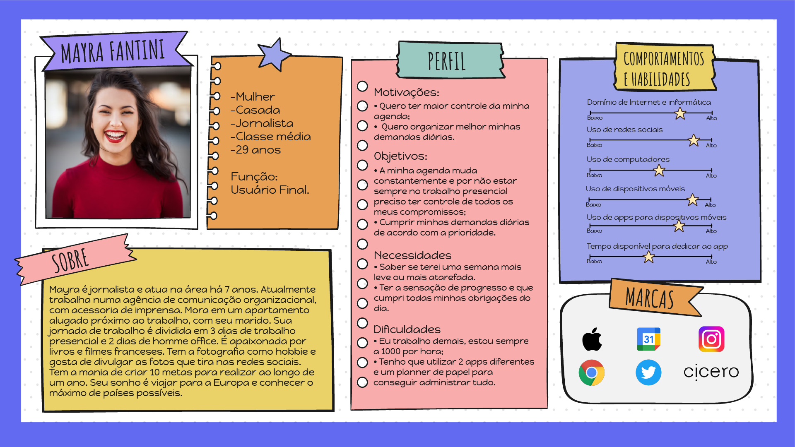
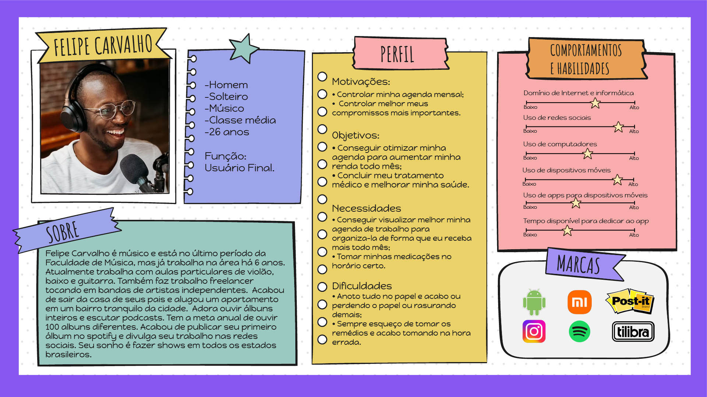
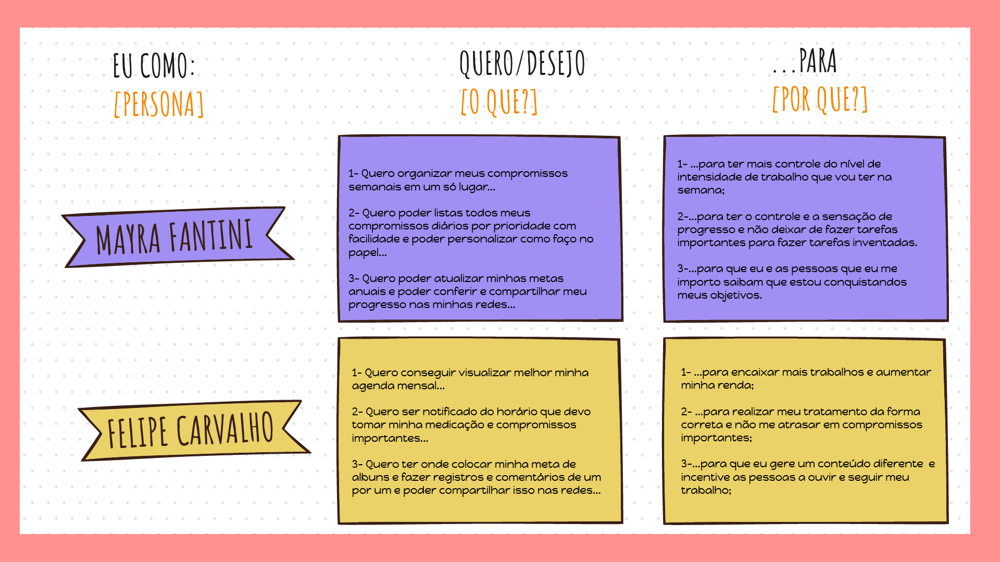
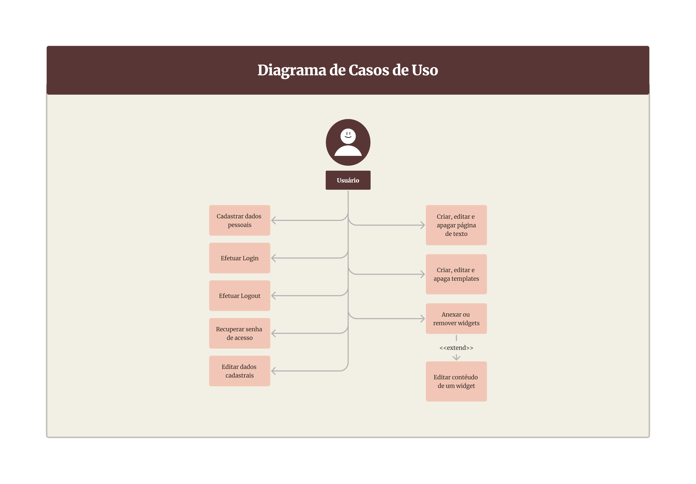

# Especificações do Projeto

Pré-requisitos: <a href="1-Documentação de Contexto.md"> Documentação de Contexto</a>

A definição exata do problema e os pontos mais relevantes a serem tratados neste projeto foi consolidada com a entrevista de 
potenciais usuários feito pelos membros da equipe a partir de um questionário com perguntas sobre a temática de gestão de tempo. 
As principais informações coletadas nesse processo foram consolidadas na criação de personas e construção de histórias de usuários.

## Personas

As personas levantadas durante o processo de entendimento do problema, realização de entrevistas e análises dos dados são apresentadas na Figuras a seguir:

## Histórias de Usuários

Com base na análise das personas forma identificadas as seguintes histórias de usuários:

## Modelagem do Processo de Negócio

### Análise da Situação Atual

Atualmente, é comum a organização da rotina e objetivos por meio de planners físicos disponíveis para a aquisição no mercado. As pessoas que preferem estruturar sua jornada em aplicativos, utilizam ferramentas diversas tais como: notes, calendários online e quadros kanban.

Na figura que se segue vê-se o funcionamento do Samsung Notes, aplicativo nativo de smartphones da marca Samsung. Ele permite, de forma customizada, criar pastas e páginas, categorizando diferentes registros no aplicativo. Nele, adiciona-se texto, desenhos à mão livre, arquivos em pdf, imagens e gravação de voz.

Demonstrado na próxima figura o diagrama do Google Agenda. Nessa ferramenta é possível incluir, monitorar e configurar alertas de eventos, compromissos, além de compartilhar a agenda com pessoas de interesse.

O quadro kanban é uma ferramenta de fluxo de trabalho e monitoramento de tarefas. Pode-se adicionar arquivos e checklists e gerenciá-lo em equipe. Um dos modos mais simples de ser utilizado é criando colunas “A fazer”, “Fazendo” e “Feito” e acrescentar e mover os cartões das atividades nas respectivas colunas que evidenciam o status de cada tarefa. Na Figura abaixo, demonstra-se a utilização da ferramenta Trello.

### Descrição Geral da Proposta

A modelagem dos processos de negócio neste projeto tem como principais alvos o alinhamento das estratégias, a demonstração do valor de cada processo e o comum entendimento acerca do funcionamento de uma atividade para o desenvolvimento da aplicação. Busca-se, assim, a criação de uma rotina de melhoria contínua do processo no contexto de toda a organização.

### Processo 1 – EFETUAR LOGIN

O processo denominado “Efetuar Login” começa com o acesso ao aplicativo. É apresentada a tela para inserção dos dados de acesso. Caso o usuário já seja cadastrado, ao inserir o e-mail e senha, sendo identificados pelo banco de dados, a sessão é iniciada com a visualização do dashboard.
Todavia, caso o usuário já cadastrado insira suas informações com e-mail correto, mas com senha inválida, o banco de dados não valida as inserções e o usuário permanece na tela para digitar os dados corretos. Após isso, o banco de dados reconhece a autenticação, a sessão inicia e apresenta a tela com o dashboard.
Em um terceiro cenário, em que o banco de dados não reconhece o e-mail, o usuário deverá realizar seu cadastro, preenchendo os dados solicitados em tela. As informações são incluídas no banco de dados, o sistema confirma a realização do cadastro e direciona para a tela de login, as informações de acesso são incluídas, a sessão é iniciada onde se visualiza a tela de dashboard.
Por ser um processo que identifica o usuário na aplicação, sua importância é percebida na segurança dos dados ao se conectar na plataforma.

### Processo 2 – AJUSTAR DADOS CADASTRAIS

O segundo processo, intitulado “Ajustar dados cadastrais” se inicia com a realização do login. O processo segue com o acesso ao perfil onde é possível editar dados cadastrais. Se os dados não estiverem preenchidos corretamente, a aplicação continua na tela de edição e exibe uma mensagem de erro, caso contrário, o banco de dados salva as informações e o sistema exibe o perfil alterado.

O ajuste desses dados mantém o banco de dados atualizado e permite a integridade dos perfis que utilizam a aplicação.

### Processo 3 – REDEFINIR SENHA

Denominado “Redefinir senha” o processo 3 se inicia na tela de login. Nela, o usuário clica em “Esqueci minha senha” sendo direcionado para a tela “Esqueci minha senha”. O sistema solicita o preenchimento do e-mail e envia para esse endereço eletrônico um PIN ao mesmo tempo que exibe na tela do usuário o campo para inserção deste. Ao constatar a compatibilidade do PIN digitado, o sistema direciona para a tela de redefinição de senha. Aqui, o usuário digita sua nova senha duas vezes para confirmação. Assim o banco de dados se atualiza com o novo dado e é exibida para o usuário a confirmação da redefinição de senha.

A redefinição de senha também é necessária quando o usuário perceber que sua senha foi descoberta e para manter a confidencialidade dos dados.

### Processo 4 – CRIAR PÁGINA DE TEXTO

No Processo 4 observa-se o caminho para criar uma página de texto. Na tela inicial o usuário clica no botão Adicionar e na página aberta insere algum texto que automaticamente é salvo no banco de dados. Desejando fazer alterações, o usuário pode, no menu superior, modificar o template escolhendo os itens que deseja personalizar, consegue ainda, inserir widget ou alterar o próprio conteúdo do texto e sua formatação nas opções do rodapé. Cada alteração feita é novamente salva imediatamente. Se o usuário quiser remover algum item inserido, basta selecioná-lo e removê-lo clicando no símbolo da “lixeira”

### Processo 5 – INSERIR WIDGETS

Para inserir widgets, conforme apresentado no Processo 5, o usuário cria a página, adiciona o widget e escolhe sua categoria sendo que cada uma disponibiliza configurações distintas para personalização de acordo com a necessidade do usuário. Se assim desejar, o usuário pode editar ou excluir o widget adicionado.

## Indicadores de Desempenho

Para análise e monitoramento do desempenho do negócio, com o intuito de auxiliar na tomada de decisões e planejamentos estratégicos, os seguintes indicadores foram definidos:

| Indicador | Objetivos  | Descrição | Cálculo  | Fonte dos Dados  | Perspectiva |
| - | - | - | -| - | - |
| Novos clientes | Monitorar a quantidade de clientes novos no mês para desenvolver estratégias de captação	|Número absoluto de clientes novos |	-	| Tabela de Users |	Aumentar a captação de clientes |
|Uso por categoria (share) |	Identificar as categorias mais utilizadas pelos usuários | Porcentagem de eventos registrados por categoria em relação a quantidade total de eventos gerados no aplicativo |	Registros da categoria X / Total de registros	| Tabela de Events |	Identificar features mais utilizadas pelos clientes |
| Usuátios ativos no mês (MAU - Monthly Active Users) |	Identificar a quantidade de clientes ativos no mês |	Porcentagem de clientes ativos no mês em relação a quantidade de clientes cadastrados na plataforma |	Clientes ativos no mês / Total de clientes cadastrados | Tabela de Users e Events	| Aumentar o percentual de clientes cadastrados que utilizam a plataforma |
| Churn dos clientes	| Analisar os clientes que deixaram a plataforma, a fim de reduzir este número	| Clientes que não utilizam o planner há mais de 30 dias e clientes que excluíram a conta	| Clientes que não usam o planner há mais de 30 dias / Clientes ativos	| Tabela de Users e Events	| Diminuir o churn e aumentar a retenção |
| Receita mensal |	Monitorar a receita mensal para criar estratégias de rentabilidade |	Receita resultante das features premium disponíveis na plataforma |	Soma das compras realizadas pelos usuários |	Tabela de Payments	| Aumentar a receita mensal |
| Perguntas mais acessadas no FAQ |	Analisar possíveis gaps na plataforma |	Identificar os assuntos mais acessados no FAQ |	Acessos por categoria / Total de acessos | Tabela de Events	| Melhorar a experiência do usuário |

## Requisitos

As tabelas que se seguem apresentam os requisitos funcionais e não funcionais que detalham o escopo do projeto. Para determinar a prioridade de requisitos, aplicar uma técnica de priorização de requisitos e detalhar como a técnica foi aplicada.

### Requisitos Funcionais

| ID     | Descrição do Requisito                                                           | Prioridade |
|--------|----------------------------------------------------------------------------------|------------|
| RF-001 | Permitir que um novo usuário se cadastre na plataforma.                          | ALTA       | 
| RF-002 | Permitir que um usuário faça login na plataforma.                                | ALTA       |
| RF-003 | Permitir que um usuário recupere sua senha.                                      | ALTA       |
| RF-004 | Permitir que um usuário anexe ou remova widgets de uma página.                   | ALTA       |
| RF-005 | Permitir que um usuário personalize uma página organizando os widgets na tela.   | MÉDIA      |
| RF-006 | Permitir que um usuário mantenha as informações criadas nos widget.              | ALTA       |
| RF-007 | Permitir que um usuário crie, edite e apague um checklist dentro de um widget.   | ALTA       |
| RF-008 | Permitir que um usuário crie, edite e apague lembretes dentro de um widget.      | ALTA       |
| RF-009 | Permitir que um usuário crie, edite e apague metas dentro de um widget.          | AlTA       |
| RF-010 | Permitir que um usuário crie, edite e hábitos dentro de um widget.               | ALTA       |
| RF-011 | Permitir que um usuário crie, edite e apague notas de texto dentro de widget.    | ALTA       |
| RF-012 | Permitir que um usuário crie, edite e apague despesas dentro de um widget.       | ALTA       |
| RF-013 | Permitir que um usuário edite os próprios dados cadastrais.                      | BAIXA      |
| RF-014 | Permitir que um usuário edite sua senha cadastrada                               | BAIXA      |
| RF-015 | Permitir que um usuário acesse informações de ajuda sobre a plataforma           | BAIXA      |
| RF-016 | Permitir que um usuário envie mensagem para contactar o suporte da plataforma    | BAIXA      |

### Requisitos não Funcionais

| ID      | Descrição do Requisito                                                                                                                                        | Prioridade |
|---------|---------------------------------------------------------------------------------------------------------------------------------------------------------------|------------|
| RNF-001 | O sistema deve oferecer uma página web e um aplicativo nativo.                                                                                                | ALTA       | 
| RNF-002 | O aplicativo deve ser compatível com as versões mais recentes do sistema Android e iOS.                                                                       | ALTA       | 
| RNF-003 | O aplicativo deve estar disponível 99,9% do tempo.                                                                                                            | MÉDIA      |
| RNF-004 | O webapp deve ser compatível com as versões mais recentes do Chrome, Edge e Safari.                                                                           | ALTA       |
| RNF-005 | O sistema disponibilizará as funcionalidades ao usuário de maneira simples e intuitiva, com foco na UX.                                                       | ALTA       |
| RNF-006 | O back-end deve ser hospedado utilizando os serviços de cloud da Azure.                                                                                       | ALTA       |
| RNF-007 | A aplicação deverá informar ao usuário sobre erros que impeçam o funcionamento correto do aplicativo, como falta de conexão, erros do servidor, entre outros. | ALTA       |
| RNF-008 | Cada widget deverá ter um limite de utilizações por página para evitar sobrecarga do sistema.                                                                 | ALTA       |

## Restrições

O projeto está restrito pelos itens apresentados na tabela a seguir.

| ID  | Restrição                                                                                                               |
|-----|-------------------------------------------------------------------------------------------------------------------------|
| 01  | A plataforma funcionará apenas com conexão à internet.                                                                  |
| 02  | A equipe não poderá subcontratar o desenvolvimento do projeto.                                                          |
| 03  | A stack do aplicativo limita-se às linguagens C#, Javascript e seus respectivos frameworks.                             |
| 04  | As fontes de dados limitam-se ao Postgres, Mongo e Redis.                                                               |
| 05  | O uso da plataforma na íntegra está condicionado ao pagamento de um plano (modelo freemium).                            |
| 06  | Todos os widgets possuem limitação de uso dentro de um documento, cujos valores são condicionados à natureza do widget. |
| 07  | Usuários do plano free podem criar apenas um documento por dia.                                                         |

## Diagrama de Casos de Uso

# Matriz de Rastreabilidade

A matriz de rastreabilidae é uma ferramenta usada para facilitar a visualização dos relacionamento entre requisitos e outros artefatos ou objetos, permitindo a rastreabilidade entre os requisitos e os objetivos de negócio.

A matriz deve contemplar todos os elementos relevantes que fazem parte do sistema, conforme a figura a seguir.

**Explicação**:

- A repetição do RF-002 se dá pelo fato de para acessar o aplicativo é necessário possuir login.
- (RF-003) Para recuperar a senha é necessário possuir cadastro (RF-001).
- RF-006 Permite o usuário anexar ou remover widgets de uma página, com isso os requisitos RF-007 ao RF-014 interagem com esses widgets referente ao RF-006.
- RNF-001 O sistema deve oferecer uma página web com as versões mais recentes do Chrome, Edge e Safari (RNF-004) e um aplicativo nativo compatível com as versões mais recentes do sistema Android e iOS (RNF-002).
- A repetição do RNF-007 se dá pelo fato de a aplicação informar ao usuário sobre erros que impeçam o funcionamento correto do aplicativo.
- A repetição do RNF-008 se dá pelo fato de cada widget ter um limite de utilizações por página para evitar sobrecarga do sistema.

# Gerenciamento de Projeto

Observando o cronograma geral do projeto de software de arquitetura distribuida, conforme a imagem abaixo, e os requisitos do projeto, é possível traçar um plano de gestão que contempla os pilares de gerenciamento para nosso projeto, segundo o PMBok, nos próximos tópicos serão observados os principais pontos abordados sobre gerenciamento de Tempo, Equipe e Orçamento.

## Gerenciamento de Tempo

O prazo total para a entrega do projeto é de 864 horas a partir do dia 01/02/2022, descontando os finais de semana, assim seguindo o cronograma geral, foi possível elaborar uma tabela com os marcos de início e fim das tarefas planejadas, conforme abaixo:

Dentro do cronograma haverão dois tipos de reunião, uma reunião semanal com o nosso stakeholder (Orientador do Projeto) e uma também semanal de alinhamento de sprints com todos os membros da equipe. Para facilitar o entendimento do cronograma de atividades, foi elaborado um gráfico de Gantt para demonstrar as atividades.

## Gerenciamento de Equipe

A equipe será separada em quatro frentes: E. Back-end, E. Front-end: Web, E. Front-end: Mobile e E. Design UX, essas quatro equipes são responsáveis pela programação de backend em ambiente C#.net, Programação das funcionalidades em ambiente React JS, Programação das funcionalidades em ambiente React Native e design das telas, assim como, a elaboração da documentação e dos testes da plataforma. Sendo essas equipes gerenciadas pelo Scrum Master e pelo Product Owner.

Com base nas equipes e cronograma de gestão de tempo, as responsabilidades de cada equipe foram atribuidas de acordo com a imagem abaixo:

## Gestão de Orçamento

Observando os custos médios no site Glassdoor, foi encontrado os salários médios para os cargos atribuidos ao projeto, com a tabela de gestão de equipe foi possivel observar a quantidade de horas atribuído a cada uma das equipes, conforme a tabela abaixo:

|Equipe              | Horas em Projeto |
|--------------------|------------------|
|E. Back-End         |  308             |
|E. Front-end: Web   |  351             |
|E. Front-end: Mobile|  417             |
|E. Design UX        |  220             |
|Scrum Master        |  297             |
|Product Owner       |  285             |

As atribuições para o Scrum master e do PO estão associadas ao início e fim do projeto, assim como nas reuniões semanais com o nosso stakeholder e as reuniões semanais das sprints. As equipes atribuidas ao projeto serão compostas por:

|Nível/Tec.      | E. Back-End | E. Front-end: Web |E. Front-end: Mobile |E. Design UX|
|----------------|-------------|-------------------|---------------------|------------|
|D. C#/.net      | 4           | 1                 | 1                   | 0          | 
|D. React Js     | 1           | 2                 | 0                   | 0          |
|D. React Native | 1           | 0                 | 2                   | 0          |
|Design UX       | 0           | 1                 | 1                   | 2          |

Os valores médios da hora para profissionais atribuídos ao projeto foram de:

|Equipe         | H-h (R$/hora)|
|---------------|--------------|
|D. C#/.net     |  31,64       |
|D. React Js    |  22,78       |
|D. React Native|  22,78       |
|E. Design UX   |  18,75       |
|Product Owner  |  60,61       |
|Scrum Master   |  60,61       |

Dessa forma podemos calcular o custo de recurso humano para a elaboração do projeto, sendo de:

|Equipe              | Custo de RH (R$) |
|--------------------|------------------|
|E. Back-End         |  9745,12         |
|E. Front-end: Web   |  7995,78         |
|E. Front-end: Mobile|  9499,26         |
|E. Design UX        |  4125,00         |
|Scrum Master        |  18.001,17       |
|Product Owner       |  17.273,85       |

Com equipamentos, foram atribuidos os custos de notebooks entre outros para o auxílio do trabalho. Os custos de software foi computado os custos de software para o auxílio a programação dos membros e desenvolvimento de software, como licenças de IDE's, utilização de API's entre outros, já os custos de operação são ligados aos custos com servidor web que comporte a aplicação, nesse caso foi escolhido a utilização do Microsoft Azure. Ao final foi acresentado um adicional de 10% aos custos para comportar possíveis oscilações de custos durante a elaboração do projeto. 

|Recursos            | Custo (R$)       |
|--------------------|------------------|
|Humano              |  66.640,18       |
|Equipamentos        |  31.493,00       |
|Software            |  20.512,56       |
|Operação            |  15.197,76       |
|Custo Total         |  133.843,50      |
|Custo Aplicado      |  147.227,87      |
