# Projeto de Interface

## Diagrama de Fluxo

O diagrama que define o fluxo do nosso sistema é representado a seguir:

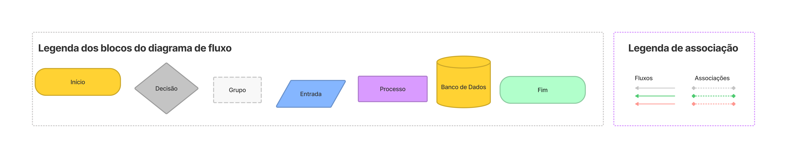
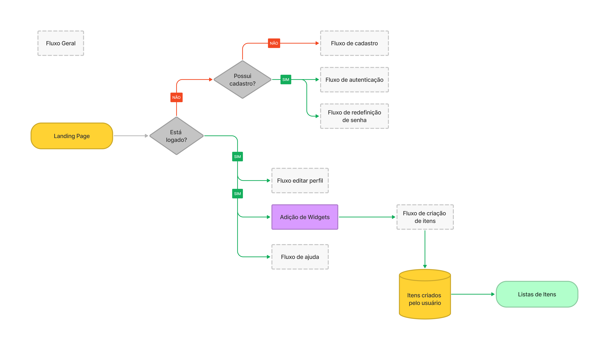

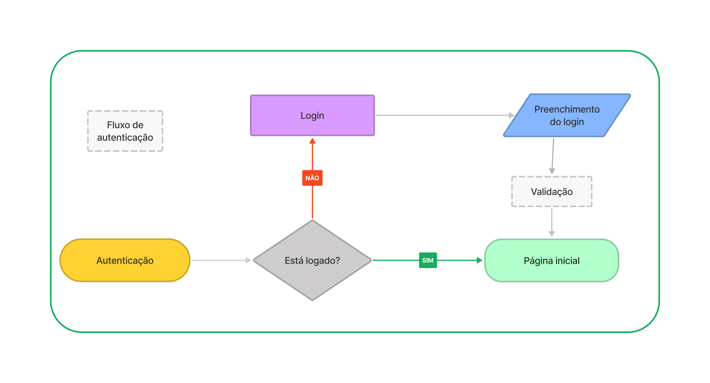
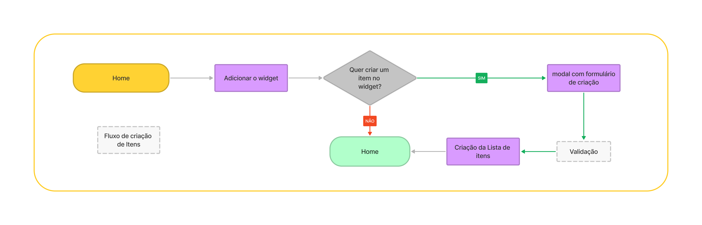
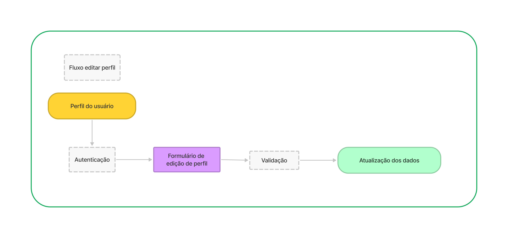

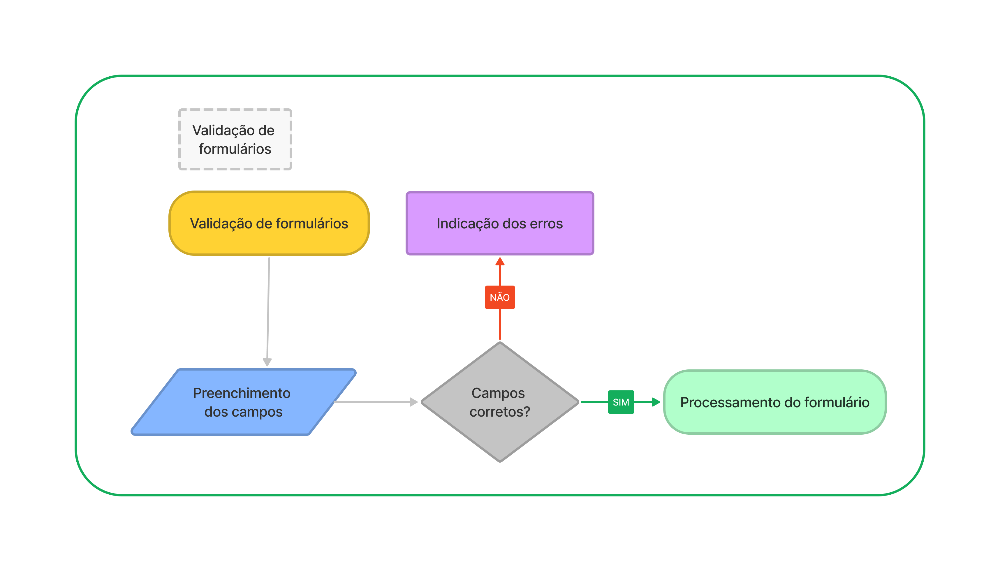
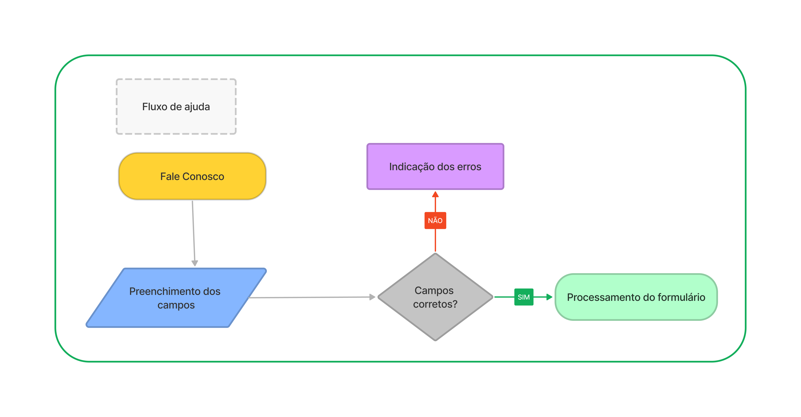

## Wireframes

Foram desenvolvidos wireframes alta fidelidade na ferramenta Figma, para ajudar na definição da estrutura da solução web e para facilitar o entendimento da relação entre as possíveis páginas existentes no sistema. A seguir os wireframes todas as páginas do sistema.

### RF-001 - Tela de Cadastro
A tela de cadastro é uma tela criada para o usuário que deseja utilizar a plataforma e salvar as criações feitas no seu planner. Nela é oferecido um formulário em que o usuário preenche suas informações pessoais e cria as credenciais de acesso ao sistema. 

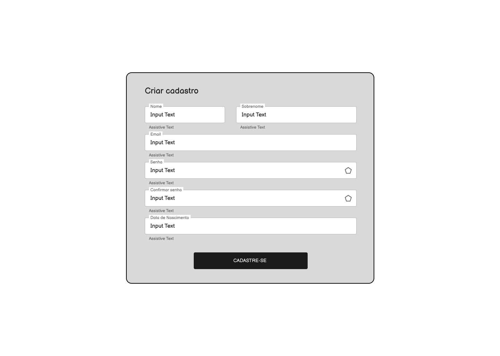

### RF-002 - Tela de Login
Quando o usuário acessa o website e não está logado na plataforma, na barra de navegação, no topo da página, haverá um botão de acesso rápido ao login do sistema. A tela contém inputs em que o usuário deverá digitar suas credenciais de acesso. Há um botão para cadastro, no caso de o usuário ainda não ser cadastrado e um botão para recuperação da senha, se o usuário a tiver esquecido.

### RF-003 - Telas de Recuperação de senha
Caso o usuário esqueça seua senha ele pode acessar a tela de recuperação de senha onde haverá um formulário para preenchimento do email e recebimento de um link para 
recuperação de senha. Ao clicar nesse link o usuário será redirecionado para a tela onde ele poderá cadastrar uma nova senha. 

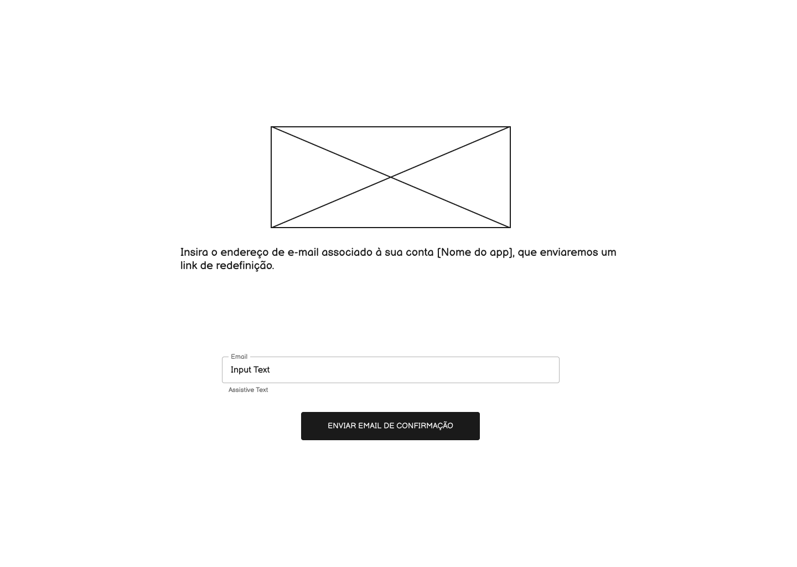
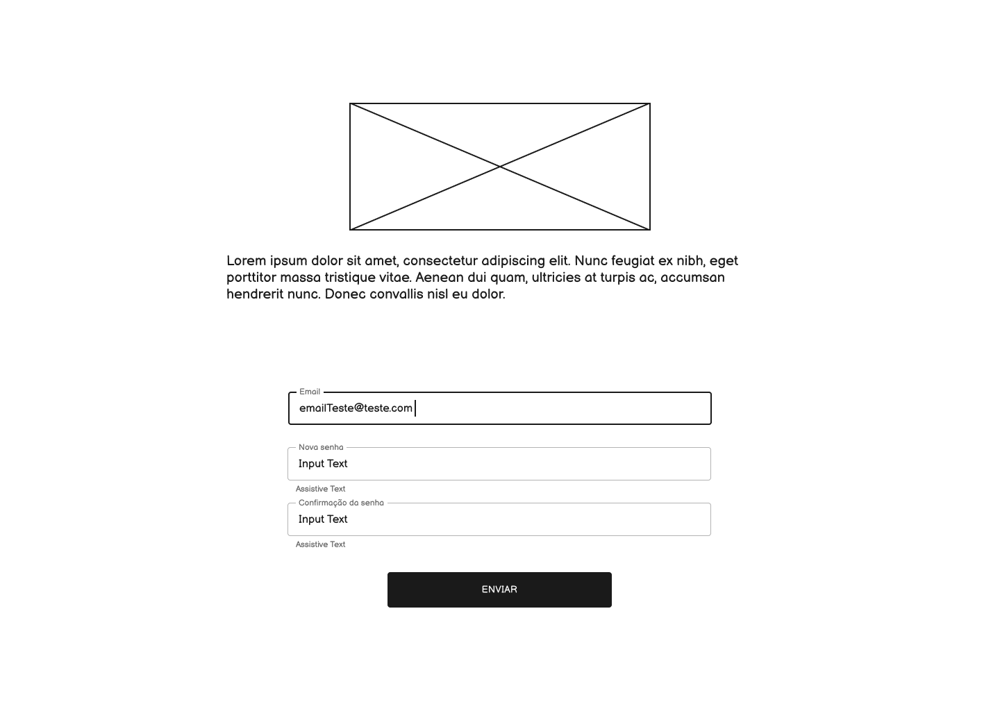

### RF-004 A 012- Landing Page
Ao entrar no endereço do website, o usuário será direcionado para essa página. Nela contém um header com os links para retornar ao inicio e direcionar a página de ajuda, além de um dropbox que o permite acessar seus dados de perfil, editá-los e fazer o logout. Abaixo, há os botões de adições dos widgets que adicionam os widgets escolhidos pelo usuário ao worskpace abaixo. O usuário pode organizar os widgets na tela e utiliza-los para cadastrar lembretes, checklists, metas, habitos, humores, controle financeiros e anotações. Alguns dos widgets apresentam modais com formulários para cadastro dessas informações. É possível cadastrar vários em cada widget.
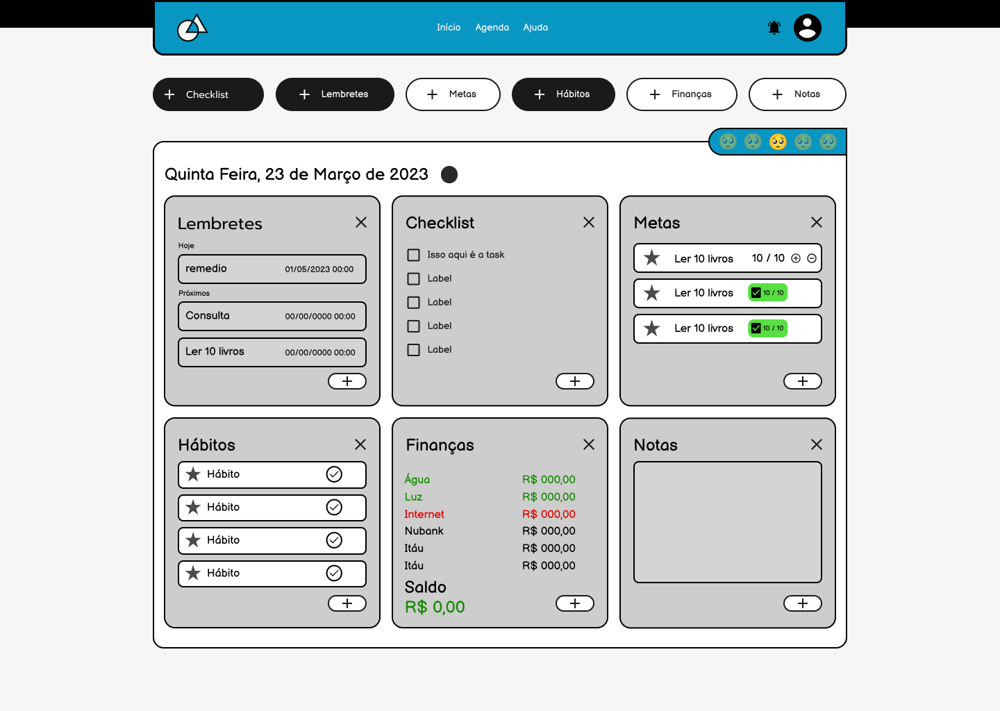

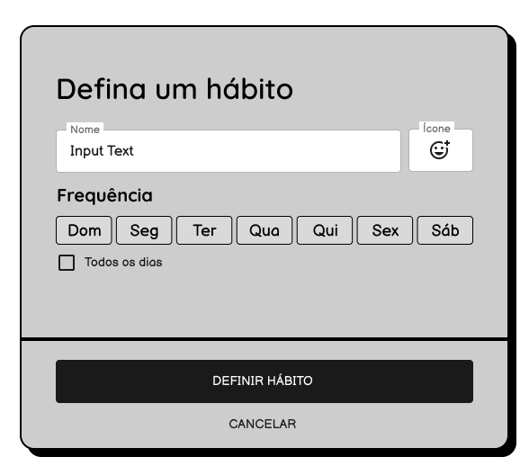
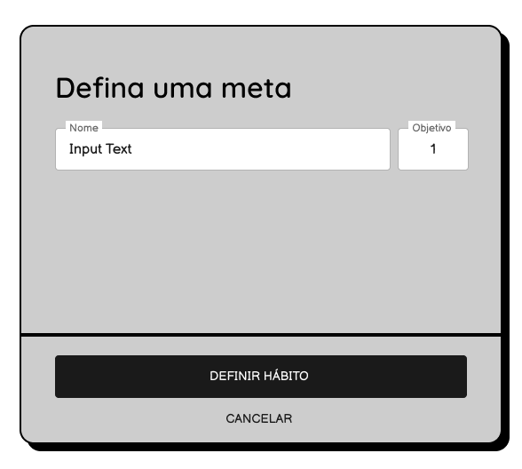
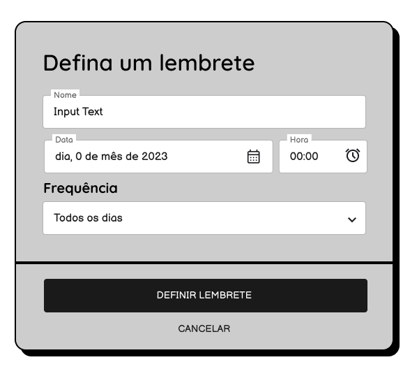

### RF-013 e 014 - Edição de Dados e senha
A tela de edição de dados permite que o usuário visualize seus dados cadastros e edite sua senha, por meio de dois formulários.
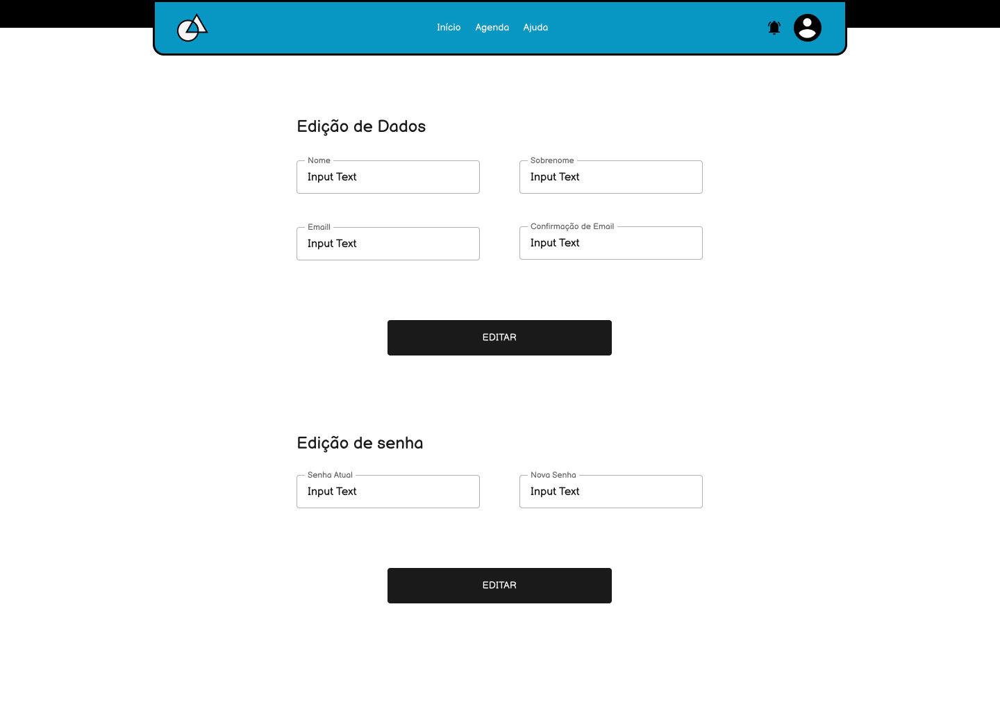

### RF-015-016 - Tela de Ajuda e Fale Conosco
Nessa tela o usuário pode acessar informações importantes sobre o que é a plataforma e seu funcionamento. Caso deseje enviar uma mensagem para o suporte pode utilizar o formulário de fale conosco que enviará um email com a mensagem para o email da plataforma. 
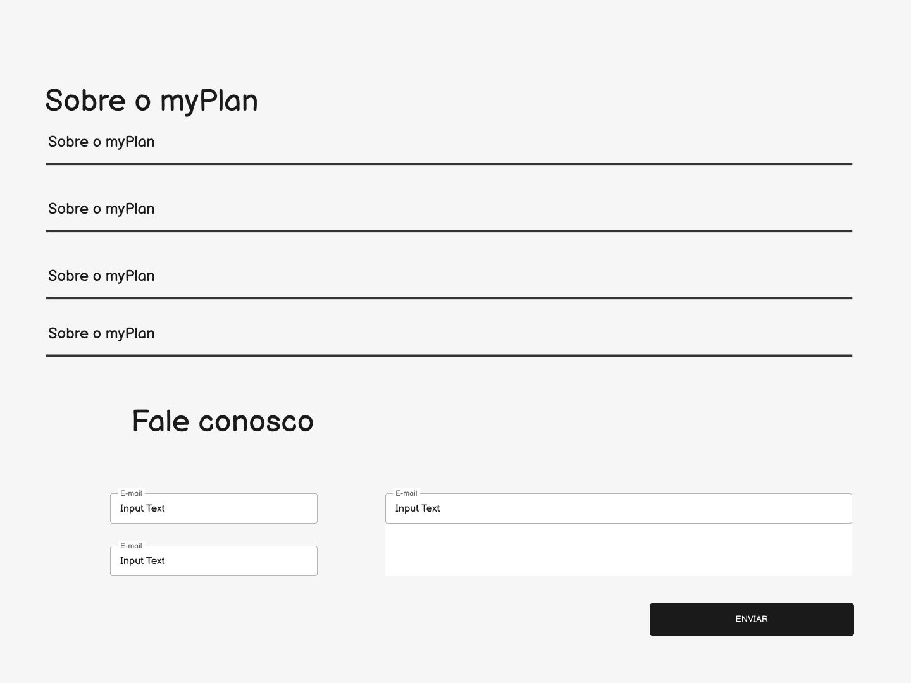