# Arquitetura da Solução

Pré-requisitos: <a href="3-Projeto de Interface.md"> Projeto de Interface</a>

A nossa solução consiste em dois front-ends comunicando-se com o back-end por meio de um API Gateway, que interage com microsserviços escritos em C# por meio de protocolo gRPC. Cada widget deverá ser desenvolvido como um microsserviço isolado e cada microsserviço contará com seu próprio banco de dados e tabelas dentro de seu domínio.

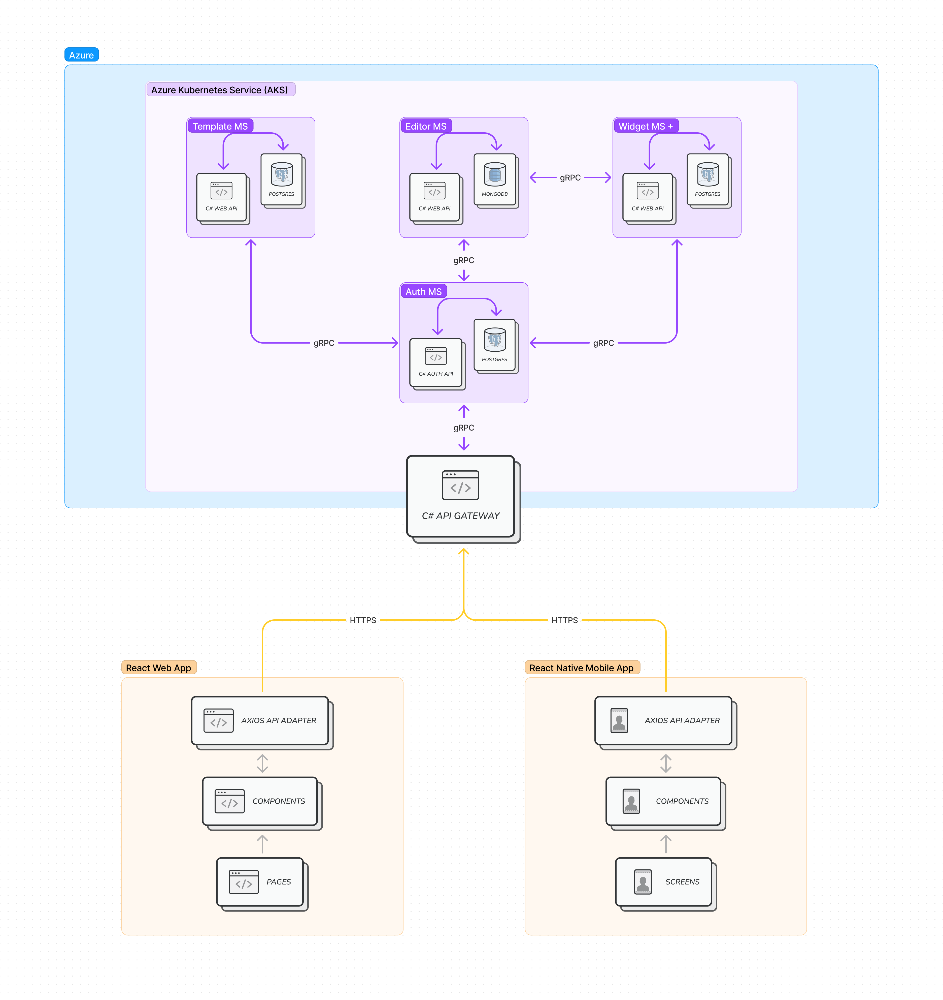

## Diagrama de Classes

O diagrama de classes ilustra graficamente como será a estrutura do software, e como cada uma das classes da sua estrutura estarão interligadas. Essas classes servem de modelo para materializar os objetos que executarão na memória.

As referências abaixo irão auxiliá-lo na geração do artefato “Diagrama de Classes”.

> - [Diagramas de Classes - Documentação da IBM](https://www.ibm.com/docs/pt-br/rational-soft-arch/9.6.1?topic=diagrams-class)
> - [O que é um diagrama de classe UML? | Lucidchart](https://www.lucidchart.com/pages/pt/o-que-e-diagrama-de-classe-uml)

## Modelo ER

O Modelo ER representa através de um diagrama como as entidades (coisas, objetos) se relacionam entre si na aplicação interativa.
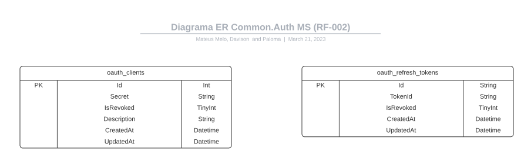
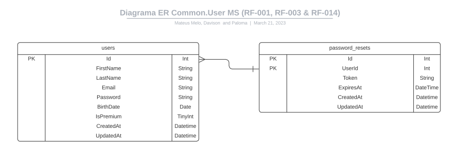
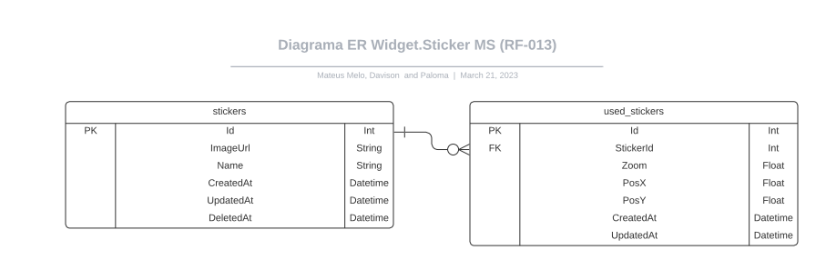

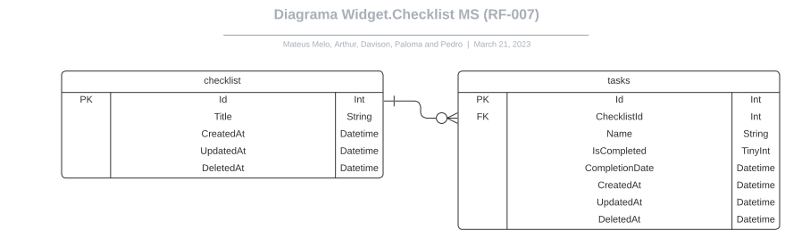
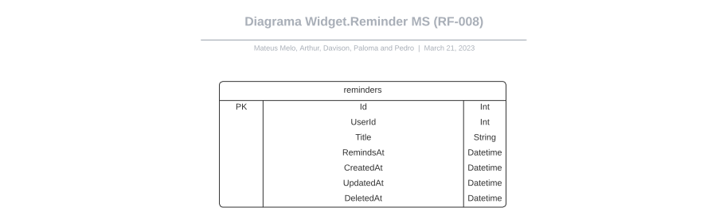

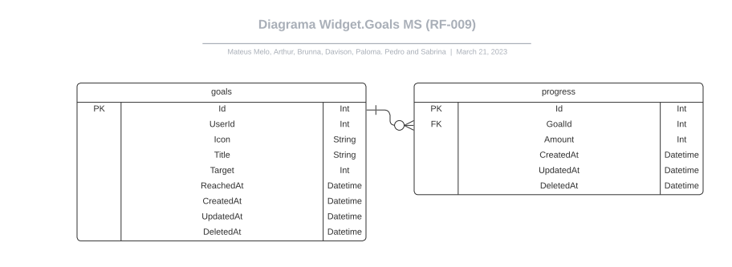
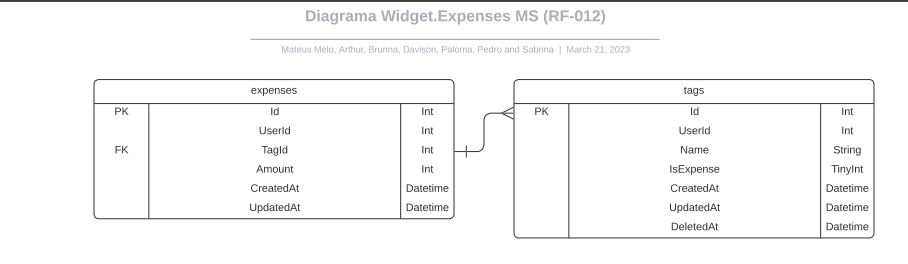

## Modelo Físico

O modelo físico da aplicação se encontra na pasta src/UserMS/src/Store.PostgreSQL/Migrations/20230329121607_InitialMigration.cs.

## Tecnologias Utilizadas

Para o desenvolvimento desse projeto foi escolhido um conjunto de tecnologias:

| Tecnologia         | Descrição                                                                                                              |
| ------------------ | ---------------------------------------------------------------------------------------------------------------------- |
| Github             | Um sistema de controle de versão distribuída e uma plataforma de hospedagem de repositórios e código-fonte.            |
| C#                 | Liguagem de programação.                                                                                               |
| Figma              | Ferramenta utilizada para o desenvolvimento do design das telas do aplicativo, wireframes e modelos de relacionamento. |
| Trello             | Ferramenta utilizada para gestão de tarefas, prazos e atividades concluídas.                                           |
| JavaScript         | Liguagem de programação.                                                                                               |
| Visual Studio Code | Ambiente de desenvolvimento integrado (IDE) principal para desenvolver o código-fonte do projeto.                      |
| React              | Biblioteca front-end JavaScript de código aberto com foco em criar interfaces de usuário em págiweb.                   |
| React Native       | Biblioteca Javascript usada para desenvolver aplicativos para os sistemas Android e iOS de forma nativa.               |
| Docker             | Plataforma utilizada para criação de contêineres para o desenvolvimento da API.                                        |
| Microsoft Azure    | Ferramenta para publicar o aplicativo e dados.                                                                         |

## Hospedagem

A equipe optou pela plataforma Microsoft Azure para a hospedagem do aplicativo.

## Qualidade de Software

Para a qualidade de software o grupo optou seguir os fundamentos da norma internacional ISO/IEC 25010. Com isso, serão analisadas as seguintes características e sub-características:

### Funcionalidade
Conjunto de atributos que evidenciam a existência de um conjunto de funções e suas propriedades especificadas. As subcaracterísticas da Funcionalidade determinadas pelo time são: Adequação, Interoperabilidade e Segurança de Acesso.
### Usabilidade
Conjunto de atributos que evidenciam o esforço necessário para poder-se utilizar o software, bem como o julgamento individual deste uso, por um conjunto implicito ou explicito de usuários. As sub-características da Usabilidade estabelecidas pela equipe são: Inteligibilidade, Apreensibilidade e Comportamento em relação aos recursos.
### Portabilidade
Conjunto de atributos que evidenciam a capacidade do software em ser transferido de um ambiente para outro. As sub-características da Usabilidade estabelecidas pela equipe são: Adaptabilidade.
### Eficiencia
Conjunto de atributos que evidenciam o esforço necessário para fazer modificações especificadas no software. As sub-características da Usabilidade estabelecidas pela equipe são: Analisabilidade.
### Manutenibilidade
Atributos do software que evidenciam o esforço necessário para modificá-lo, remover seus defeitos ou adaptá-lo a mudanças ambientais. As sub-características da Usabilidade estabelecidas pela equipe são: Modificabilidade e Testabilidade.

## Documentação da implementação da Web API reset Rotas
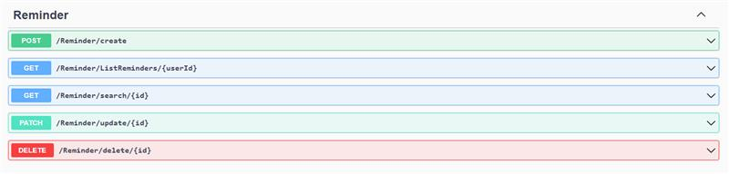
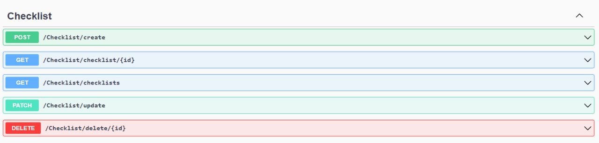
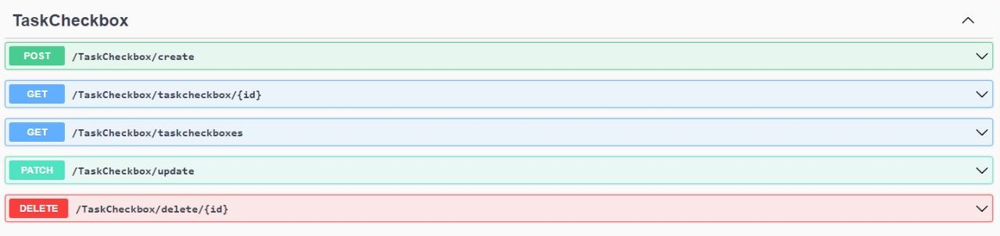
## Documentação da implementação das funcionalidades que envolvem o banco de dados NoSQL
A equipe optou por utilizar inicialmente o PostgreSQL.
