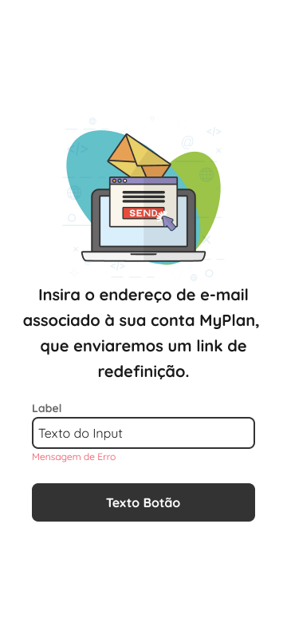

# Template Padrão da Aplicação

Para o Layout padrão da aplicação foi desenvolvido um Design System, cuja aplicação deve ser feita em todas as páginas do sistema, respeitando a identidade visual. Os elementos do Design System:

## Design System

## Template padrão
A seguir as telas do sistema com a identidade visual aplicada a partir do Design System:

### RF-001-Cadastro

### RF-002-Login

### RF-003-Recuperação de Senha

### RF-004 a 012 Landing Page e modais

### RF-013-014 Edição de perfil e Senha

### RF-015-016-Ajuda e Fale Conosco

